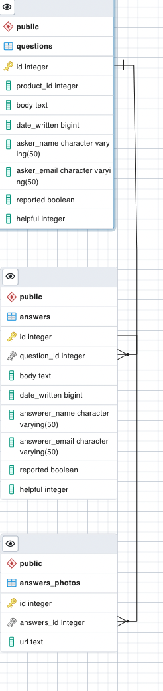

# System Design Capstone: Q & A API

The goal of the project was to build a scalable RESTful API for an existing e-commerce web application and optimize it to withstand the web scale traffic loads. Working in a team of three engineers, we inherited a legacy codebase and each member took ownership of a micro service that will maintain the existing application data set. I was responsible for redesigning and building a backend server and database for the Q & A API service.

## Tech Stack


## API Development & Optimization



- Design and evaluate **RDBMS** and **DBMS** and consider tradeoffs: selected **PostgreSQL**

- Performe an **ETL Process** to transfer the full application data set (20M+) into PostgreSQL database

- Optimize queries using **B-tree indexes**, **ORM sequelize** and building **aggregate tables**

## Deployment

- Set up **NGINX load balancer** with ip_hash method for horizontal scaling and reduce latency by 200%
- Set up indexes with B-tree method and reduce latency by 400%
- Scale microservice to handle 1000 RPS by deploying 3 Node/Express servers and database on **AWS EC2**

## Load & Stress Testing

- Conducted cloud-based performance and stress testing on **loader.io** with randomized questions IDs
- Achieved 1000 RPS with latency 70~1000ms with 0% error rate

## API Endpoints

### `GET /qa/:productId`

Retrieve a list of questions for a product

#### Parameters

| Parameter  | Type    | Description                                               |
| ---------- | ------- | --------------------------------------------------------- |
| product_id | Integer | Specifies the product for which to retrieve questions.    |
| page       | Integer | Selects the page of results to return. Default 1.         |
| count      | Integer | Specifies how many results per page to return. Default 5. |

#### Response

```json
{
  "product_id": "5",
  "results": [
    {
      "question_id": 37,
      "question_body": "Why is this product cheaper here than other sites?",
      "question_date": "2018-10-18T00:00:00.000Z",
      "asker_name": "williamsmith",
      "question_helpfulness": 4,
      "reported": false,
      "answers": {
        "68": {
          "id": 68,
          "body": "We are selling it here without any markup from the middleman!",
          "date": "2018-08-18T00:00:00.000Z",
          "answerer_name": "Seller",
          "helpfulness": 4,
          "photos": []
          // ...
        }
      }
    },
    {
      "question_id": 38,
      "question_body": "How long does it last?",
      "question_date": "2019-06-28T00:00:00.000Z",
      "asker_name": "funnygirl",
      "question_helpfulness": 2,
      "reported": false,
      "answers": {
        "70": {
          "id": 70,
          "body": "Some of the seams started splitting the first time I wore it!",
          "date": "2019-11-28T00:00:00.000Z",
          "answerer_name": "sillyguy",
          "helpfulness": 6,
          "photos": []
        },
        "78": {
          "id": 78,
          "body": "9 lives",
          "date": "2019-11-12T00:00:00.000Z",
          "answerer_name": "iluvdogz",
          "helpfulness": 31,
          "photos": []
        }
      }
    }
    // ...
  ]
}
```

### `GET /qa/:questionId/answers`

Returns all the answers for a specified question id.

#### Parameters

| Parameter   | Type    | Description                                               |
| ----------- | ------- | --------------------------------------------------------- |
| question_id | Integer | Required ID of the question for which answers are needed  |
| page        | Integer | Selects the page of results to return. Default 1.         |
| count       | Integer | Specifies how many results per page to return. Default 5. |

#### Response

```json
{
  "question": "1",
  "page": 0,
  "count": 5,
  "results": [
    {
      "answer_id": 8,
      "body": "What a great question!",
      "date": "2018-01-04T00:00:00.000Z",
      "answerer_name": "metslover",
      "helpfulness": 8,
      "photos": []
    },
    {
      "answer_id": 5,
      "body": "Something pretty durable but I can't be sure",
      "date": "2018-01-04T00:00:00.000Z",
      "answerer_name": "metslover",
      "helpfulness": 5,
      "photos": [
        {
          "id": 1,
          "url": "urlplaceholder/answer_5_photo_number_1.jpg"
        },
        {
          "id": 2,
          "url": "urlplaceholder/answer_5_photo_number_2.jpg"
        }
        // ...
      ]
    }
    // ...
  ]
}
```

### `POST /qa/:productId`

Adds a question for the given product.

#### Parameters

| Parameter  | Type    | Description                                          |
| ---------- | ------- | ---------------------------------------------------- |
| body       | text    | Text of question being asked                         |
| name       | text    | Username for question asker                          |
| email      | text    | Email address for question asker                     |
| product_id | Integer | Required ID of the Product for which the question is |

#### Response

```json
Status: 201 CREATED
```

### `POST /qa/:questionId/answers`

Adds an answer for the given question.

#### Parameters

| Parameter   | Type    | Description                                         |
| ----------- | ------- | --------------------------------------------------- |
| question_id | Integer | Required ID of the question to post the answer for  |
| body        | text    | Text of question being asked                        |
| name        | text    | Username for question asker                         |
| email       | text    | Email address for question asker                    |
| photos      | text    | An array of urls corresponding to images to display |

#### Response

```json
Status: 201 CREATED
```

### `PUT /qa/questions/:question_id/helpful`

Updates a question to show it was found helpful..

#### Parameters

| Parameter   | Type    | Description                                        |
| ----------- | ------- | -------------------------------------------------- |
| question_id | Integer | Required ID of the question to post the answer for |

#### Response

```json
Status: 204 NO CONTENT
```
